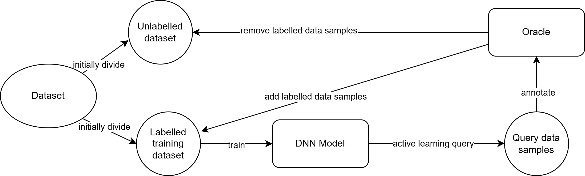
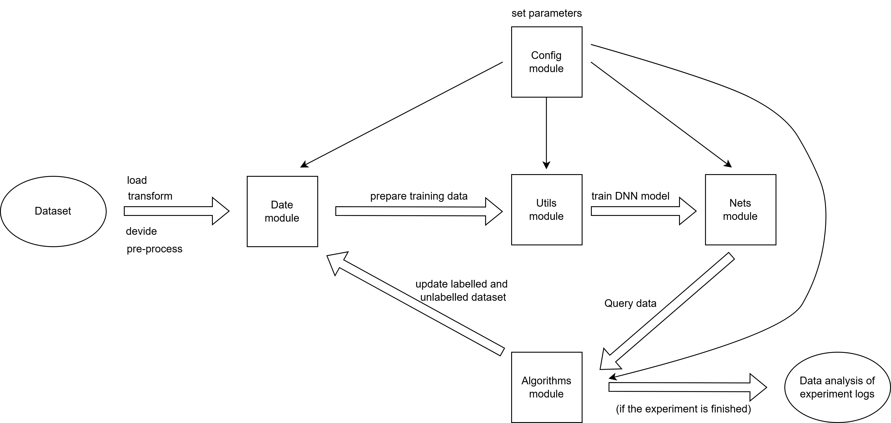
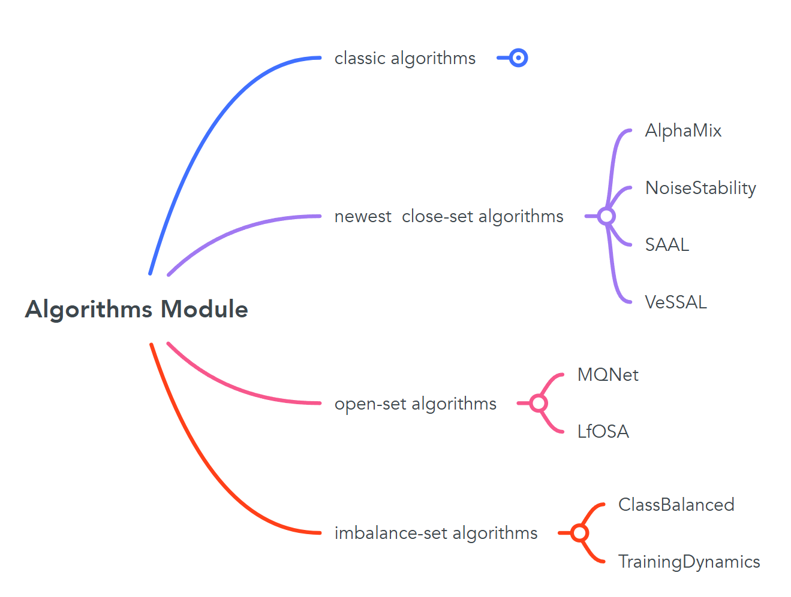
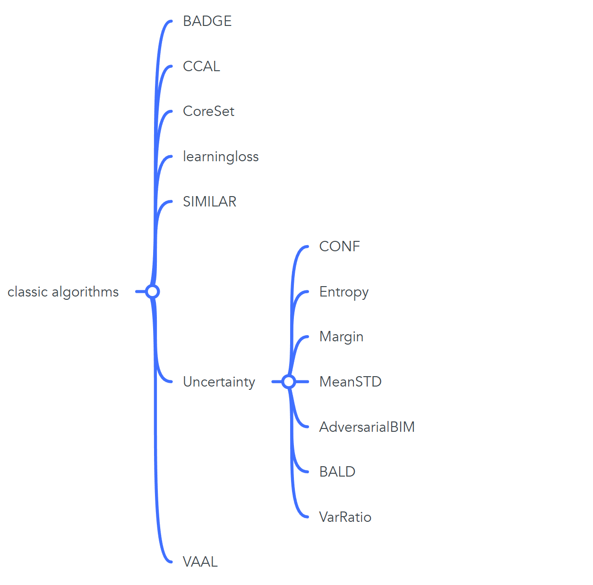

This is the code implementation for Chenkai Wu's honours project (Deep Active Learning with Rationales) supervised by Dr Lan Du.

Active learning (AL) attempts to measure the value of data, selecting only the most valuable portion for labeling to reduce labeling costs. While deep active learning (DAL) combines deep learning and active learning, aiming to maintain good performance of Deep Learning models with as little data as possible.

 

In this honours project, we designed a new platform for DAL which can help researchers to evalute various DAL algorithms' performance. 

This platform is built on a modular structure, making it easy to modify and add new algorithms and tasks, laying a solid foundation for further expansion in the future.

 

This platform also includes 21 DAL algorithms, eight of which are the latest (introduced in 2022 or later). Among these, two algorithms address open-set scenarios, and two handle imbalanced-sets.

    
    

Finally, we extend our sincere gratitude to the authors of previous DAL algorithms and platforms. These prior contributions have greatly benefited this honors project.

### Environment Setup

0. Preparation
   - Install Ubuntu. I am using version 22.04.
   - Install the Nvidia GPU driver. For my RTX 4090, I installed version 535.183.01.
   - Install CUDA and NVCC (CUDA compiler driver). I am using version 12.2.
   - (Optional, for setting up a virtual environment) Install Anaconda.

1. Create a Virtual Environment and Install PyTorch
   - If using Anaconda, you can set up a virtual environment based on Python 3.9 with the following command:
     * `conda create -n 'dalb' python=3.9`
     * `conda activate dalb`

2. Install Most Dependencies
   - This step can be completed using the `requirements.txt` file provided by the platform via `pip`.
     * `pip install -r requirements.txt`

3. Install the Final Dependencies: `torchlars` and `submodlib`
   - Since installing `torchlars` requires `torch` to be installed beforehand, it is necessary to run this command after executing `pip install -r requirements.txt`; otherwise, it will return an error.  
     * `pip install torchlars==0.1.2`
   - For installing `submodlib`, I recommend using the "Alternative 2" method provided by the submodlib [GitHub repository](https://github.com/decile-team/submodlib).
     * `git clone https://github.com/decile-team/submodlib.git`
     * `cd submodlib`
     * `pip install .`
     * `cd ..`
     * (optional, since submodlib has been installed) `rm -rf submodlib`

### References

* MQ-Net\[[code](https://github.com/kaist-dmlab/MQNet)\] : Meta-Query-Net: Resolving Purity-Informativeness Dilemma in Open-set Active Learning, Park et al. 2022 NeurIPS
* TiDAL\[[code](https://github.com/hyperconnect/TiDAL)\]: TiDAL: Learning Training Dynamics for Active Learning, Kye et al. 2023 ICCV
* Class-Balanced-AL\[[code](https://github.com/Javadzb/Class-Balanced-AL)\]: Class-Balanced Active Learning for Image Classification, Bengar et al. 2022 WACV
* ALFA-Mix\[[code](https://github.com/AminParvaneh/alpha_mix_active_learning)\]: Active Learning by Feature Mixing, Parvaneh et al. 2022 CVPR
* LfOSA\[[code](https://github.com/ningkp/LfOSA)\]: Active Learning for Open-set Annotation, Ning et al. 2022 CVPR
* NoiseStability\[[code](https://github.com/phanxuanphucnd/Deep-AL-with-Noise-Stability)\]: Deep Active Learning with Noise Stability, Li et al. 2024 AAAI
* SAAL\[[code](https://github.com/YoonyeongKim/SAAL)\]: SAAL: Sharpness-Aware Active Learning, Kim et al. 2023 ICML
* VeSSAL\[[code](https://github.com/asaran/VeSSAL)\]: Streaming Active Learning with Deep Neural Networks, Saran et al. 2023 ICML
* DeepAL+\[[code](https://github.com/SineZHAN/deepALplus)\]: DeepAL+: Deep Active Learning Toolkit, Zhan et al. 2022
* Coreset \[[code](https://github.com/svdesai/coreset-al)\] : Active Learning for Convolutional Neural Networks: A Core-Set Approach, Sener et al. 2018 ICLR
* LL \[[code](https://github.com/Mephisto405/Learning-Loss-for-Active-Learning)\] : Learning Loss for Active Learning, Yoo et al. 2019 CVPR
* BADGE \[[code](https://github.com/JordanAsh/badge)\] : Deep Batch Active Learning by Diverse, Uncertain Gradient Lower Bounds, Jordan et al. 2020 ICLR
* CCAL \[[code](https://github.com/RUC-DWBI-ML/CCAL)\] : Contrastive Coding for Active Learning under Class Distribution Mismatch, Du et al. 2021 ICCV
* SIMILAR \[[code](https://github.com/decile-team/distil)\] : SIMILAR: Submodular Information Measures based Active Learning in Realistic Scenarios, Kothawade et al. 2021 NeurIPS