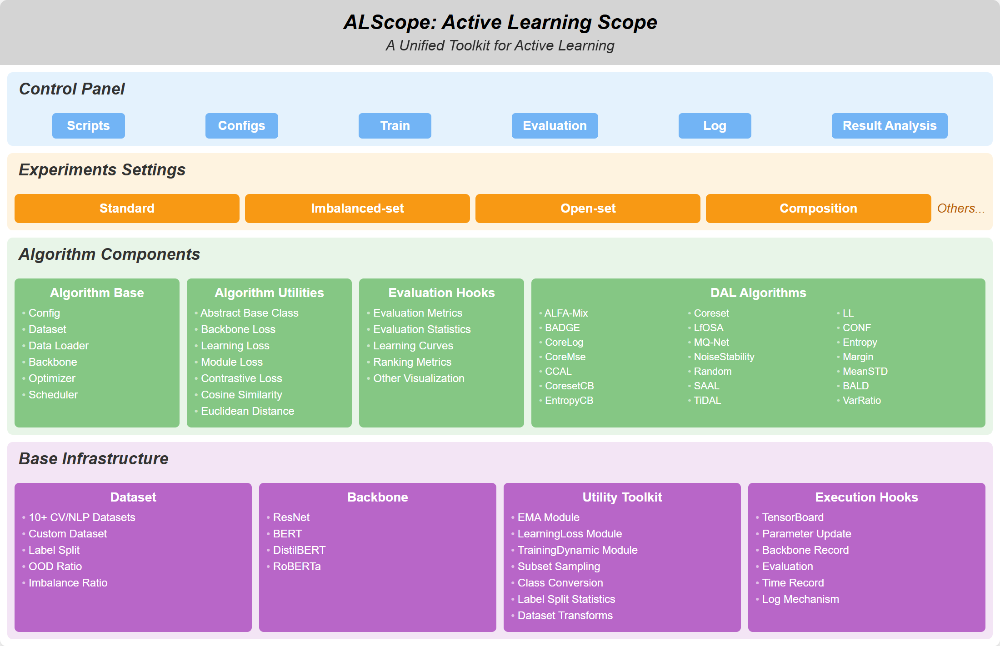

# ALScope: A Unified Toolkit for Deep Active Learning

<p align="center">
  
</p>

<p align="center">
  <a href="https://github.com/WuXixiong/DALBenchmark">
    
  </a>
  <a href="#license">
    
  </a>
  <a href="#citation">
    
  </a>
</p>

## 🔥 What is ALScope?

**ALScope** is a comprehensive and unified platform for **Deep Active Learning (DAL)** that addresses the critical need for standardized, reproducible, and flexible evaluation of active learning algorithms. As deep learning models require increasingly large amounts of labeled data, active learning emerges as a crucial approach to reduce annotation costs by strategically selecting the most informative samples for labeling.

### 🎯 Why ALScope?

Existing DAL platforms suffer from several limitations:
- **Limited algorithm coverage** - Most platforms include only a small subset of recent methods
- **Domain constraints** - Primarily focused on computer vision, lacking NLP support  
- **Unrealistic settings** - Evaluation limited to closed-set conditions, ignoring real-world challenges

ALScope overcomes these limitations by providing:
- ✅ **21 representative DAL algorithms**
- ✅ **Cross-domain support** for both Computer Vision and Natural Language Processing
- ✅ **Realistic evaluation scenarios** including open-set and class-imbalanced settings
- ✅ **Flexible configuration** of experimental parameters
- ✅ **Modular design** for easy extension and customization

## 🚀 Key Features

### 📊 Comprehensive Algorithm Collection
- **21 representative DAL algorithms** spanning multiple paradigms:
  - Uncertainty-based methods
  - Diversity-based approaches  
  - Hybrid strategies
  - Specialized algorithms for imbalanced datasets
  - Methods for handling open-set scenarios

### 🌐 Multi-Domain Dataset Support
- **10 diverse datasets** across CV and NLP domains:
  - **Computer Vision**: CIFAR-10/100, TinyImageNet, and more
  - **Natural Language Processing**: AGNEWS, YELP, SST-5, TREC-6, and more

### 🔧 Flexible Experimental Configuration
- Configurable backbone architectures
- Adjustable initial sample sizes and query batch sizes
- Controllable out-of-distribution (OOD) sample ratios
- Customizable class imbalance ratios
- Support for various task-specific factors

### 🏗️ Modular Architecture
- Easy integration of new algorithms
- Seamless addition of new datasets
- Reproducible experimental setups
- Standardized evaluation metrics

## 🛠️ Installation

### Prerequisites
Before installing ALScope, ensure you have the following:

- **Ubuntu** (tested on version 22.04)
- **NVIDIA GPU driver** (e.g., version 535.183.01 for RTX 4090)
- **CUDA and NVCC** (CUDA compiler driver, tested on version 12.2)
- **Anaconda** (optional, for virtual environment management)

### Step 1: Clone Repository and Setup Environment

```bash
# Clone the repository
git clone https://github.com/WuXixiong/DALBenchmark.git
cd DALBenchmark

# Create conda environment (recommended)
conda create -n dalb python=3.9
conda activate dalb
```

### Step 2: Install Core Dependencies

```bash
# Install most dependencies via requirements.txt
pip install -r requirements.txt
```

### Step 3: Install Additional Dependencies

Some packages require special installation due to dependencies:

```bash
# Install torchlars (requires torch to be pre-installed)
pip install torchlars==0.1.2

# Install submodlib from source (recommended approach)
git clone https://github.com/decile-team/submodlib.git
cd submodlib
pip install .
cd ..

# Optional: remove cloned repository
rm -rf submodlib
```

### Verification

Test your installation by running a simple experiment:

```bash
python main.py --method entropy --dataset CIFAR10 --trial 1 --cycle 2 \
    --n-initial 100 --n-query 100 --n-class 10 --epochs 10
```

## 🏃‍♂️ Quick Start

### Standard Setting
Run a standard deep active learning experiment:

```bash
python main.py --method coremse --uncertainty Entropy --dataset CIFAR100 \
    --trial 5 --cycle 10 --n-initial 500 --n-query 500 --n-class 100 \
    --epochs 200 --n-drop 5
```

**Key Parameters:**
- `--method`: DAL algorithm to use (e.g., coremse, badge, learning_loss)
- `--uncertainty`: Classical uncertainty-based method (e.g., Entropy, LeastConfidence, Margin)
- `--dataset`: Dataset name (e.g., CIFAR10, CIFAR100, TinyImageNet, AGNEWS)
- `--trial`: Number of independent trials to run
- `--cycle`: Number of active learning cycles per trial
- `--n-initial`: Initial labeled samples to start with
- `--n-query`: Samples to query per cycle
- `--n-class`: Number of classes in the dataset
- `--epochs`: Training epochs per cycle
- `--n-drop`: Monte Carlo dropout iterations (if applicable)

### Open-set Setting
For realistic scenarios with out-of-distribution (OOD) samples:

```bash
python main.py --method cdal --uncertainty Entropy --dataset CIFAR10 \
    --trial 5 --cycle 10 --n-initial 100 --n-query 100 --n-class 10 \
    --epochs 200 --n-drop 5 --openset --ood-rate 0.2
```

**Additional Parameters:**
- `--openset`: Enable open-set recognition mode
- `--ood-rate`: Percentage of unlabeled pool that consists of OOD samples (0.2 = 20%)

### Imbalanced-set Setting
For scenarios with severe class imbalance:

```bash
python main.py --method cal --uncertainty Entropy --dataset CIFAR10 \
    --trial 5 --cycle 10 --n-initial 100 --n-query 100 --n-class 10 \
    --epochs 200 --n-drop 5 --imb-factor 0.2
```

**Additional Parameters:**
- `--imb-factor`: Class imbalance factor (lower values = more imbalanced, e.g., 0.2 for highly long-tailed distribution)

### Batch Experiments
Create a script file to run multiple experiments:

```bash
#!/bin/bash

# Compare different algorithms on CIFAR-10
algorithms=("entropy" "margin" "badge" "learning_loss" "coremse")

for method in "${algorithms[@]}"; do
    python main.py --method $method --dataset CIFAR10 \
        --trial 3 --cycle 10 --n-initial 1000 --n-query 1000 \
        --n-class 10 --epochs 100
done
```

<!-- ## 📚 Supported Algorithms

### Uncertainty-Based Methods
- Least Confidence
- Margin Sampling  
- Entropy Sampling
- MC Dropout
- Deep Ensemble
- And more...

### Diversity-Based Methods
- Core-Set
- And more...

### Hybrid Methods
- BADGE
- Learning Loss
- TiDAL
- SAAL
- And more...

### Specialized Methods
- **For Open-set**: LfOSA
- **For Imbalanced data**: EntropyCB, CoresetCB

## 📊 Supported Datasets

### Computer Vision
- CIFAR-10/100
- TinyImageNet  
- And more...

### Natural Language Processing
- AGNEWS
- YELP
- SST-5
- TREC-6
- And more... -->

<!-- ## 📖 Documentation

For detailed documentation, please refer to:
- [Algorithm Documentation](docs/algorithms.md)
- [Dataset Documentation](docs/datasets.md)
- [Configuration Guide](docs/configuration.md)
- [API Reference](docs/api.md) -->

<!-- ## 🔬 Experimental Results

Our extensive experiments reveal several key insights:

1. **Domain-dependent performance**: DAL algorithms show significantly different performance across CV and NLP domains
2. **Challenge-specific requirements**: Non-standard scenarios (imbalanced, open-set) require specialized approaches
3. **Efficiency trade-offs**: Some high-performing algorithms require substantially longer selection time

For detailed experimental results and analysis, please refer to our paper. -->

<!-- ## 🤝 Contributing

We welcome contributions from the community! Please see [CONTRIBUTING.md](CONTRIBUTING.md) for guidelines on:
- Adding new algorithms
- Integrating new datasets
- Reporting bugs and issues
- Submitting feature requests -->

<!-- ## 📄 Citation

If you find ALScope useful in your research, please consider citing our paper:

```bibtex
@article{wu2024alscope,
  title={ALScope: A Unified Toolkit for Deep Active Learning},
  author={Wu, Xixiong and others},
  journal={arXiv preprint arXiv:xxxx.xxxxx},
  year={2024}
} 
```
-->


## 📜 License

This project is licensed under the Apache License 2.0 - see the [LICENSE](LICENSE) file for details.

## 🙏 Acknowledgments

We extend our sincere gratitude to:
- The authors of previous DAL algorithms whose implementations served as inspiration
- The developers of existing DAL platforms that laid the foundation for this work
- The open-source community for their valuable datasets and tools

### References

* MQ-Net\[[code](https://github.com/kaist-dmlab/MQNet)\] : Meta-Query-Net: Resolving Purity-Informativeness Dilemma in Open-set Active Learning, Park et al. 2022 NeurIPS
* TiDAL\[[code](https://github.com/hyperconnect/TiDAL)\]: TiDAL: Learning Training Dynamics for Active Learning, Kye et al. 2023 ICCV
* Class-Balanced-AL\[[code](https://github.com/Javadzb/Class-Balanced-AL)\]: Class-Balanced Active Learning for Image Classification, Bengar et al. 2022 WACV
* ALFA-Mix\[[code](https://github.com/AminParvaneh/alpha_mix_active_learning)\]: Active Learning by Feature Mixing, Parvaneh et al. 2022 CVPR
* LfOSA\[[code](https://github.com/ningkp/LfOSA)\]: Active Learning for Open-set Annotation, Ning et al. 2022 CVPR
* NoiseStability\[[code](https://github.com/phanxuanphucnd/Deep-AL-with-Noise-Stability)\]: Deep Active Learning with Noise Stability, Li et al. 2024 AAAI
* SAAL\[[code](https://github.com/YoonyeongKim/SAAL)\]: SAAL: Sharpness-Aware Active Learning, Kim et al. 2023 ICML
* VeSSAL\[[code](https://github.com/asaran/VeSSAL)\]: Streaming Active Learning with Deep Neural Networks, Saran et al. 2023 ICML
* DeepAL+\[[code](https://github.com/SineZHAN/deepALplus)\]: DeepAL+: Deep Active Learning Toolkit, Zhan et al. 2022
* Coreset \[[code](https://github.com/svdesai/coreset-al)\] : Active Learning for Convolutional Neural Networks: A Core-Set Approach, Sener et al. 2018 ICLR
* LL \[[code](https://github.com/Mephisto405/Learning-Loss-for-Active-Learning)\] : Learning Loss for Active Learning, Yoo et al. 2019 CVPR
* BADGE \[[code](https://github.com/JordanAsh/badge)\] : Deep Batch Active Learning by Diverse, Uncertain Gradient Lower Bounds, Jordan et al. 2020 ICLR
* CCAL \[[code](https://github.com/RUC-DWBI-ML/CCAL)\] : Contrastive Coding for Active Learning under Class Distribution Mismatch, Du et al. 2021 ICCV
* SIMILAR \[[code](https://github.com/decile-team/distil)\] : SIMILAR: Submodular Information Measures based Active Learning in Realistic Scenarios, Kothawade et al. 2021 NeurIPS
* BEMPS \[[code](https://github.com/davidtw999/BEMPS)\] : Diversity Enhanced Active Learning with Strictly Proper Scoring Rules, Tan et al., 2021 NeurIPS

<!-- ## 📞 Contact

- **Author**: Chenkai Wu
- **Email**: wuxixiong2020@gmail.com
- **Issues**: Please use GitHub Issues for bug reports and feature requests -->
---

<p align="center">
  <strong>⭐ If you find ALScope helpful, please star this repository! ⭐</strong>
</p>
